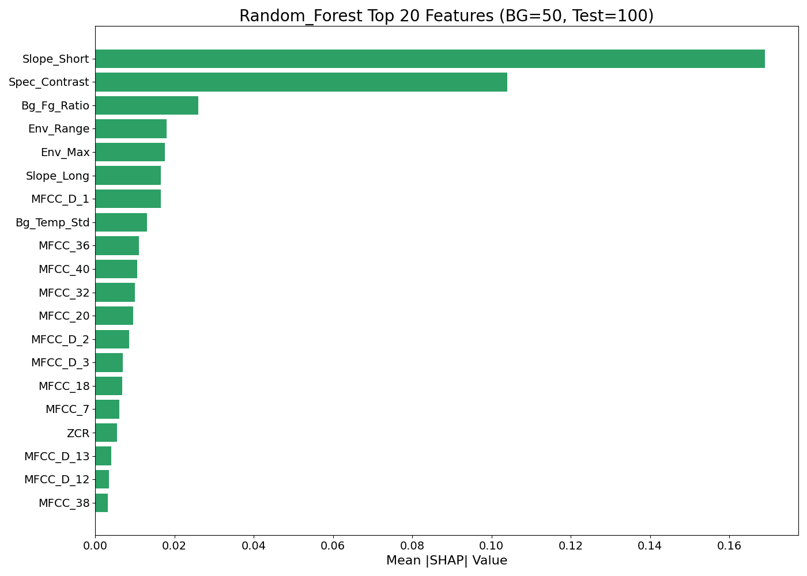
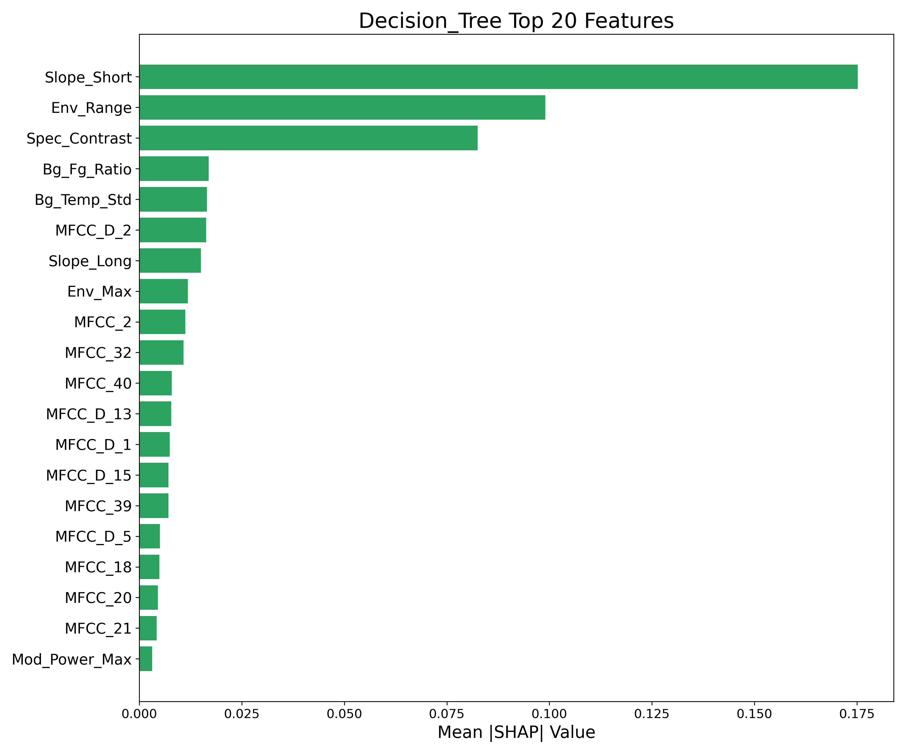
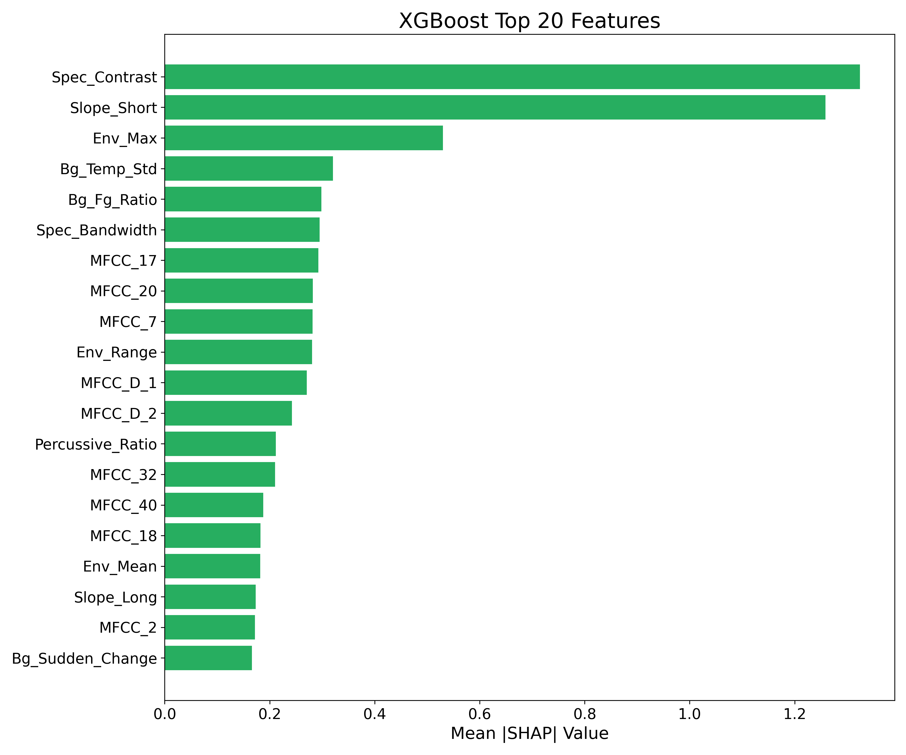
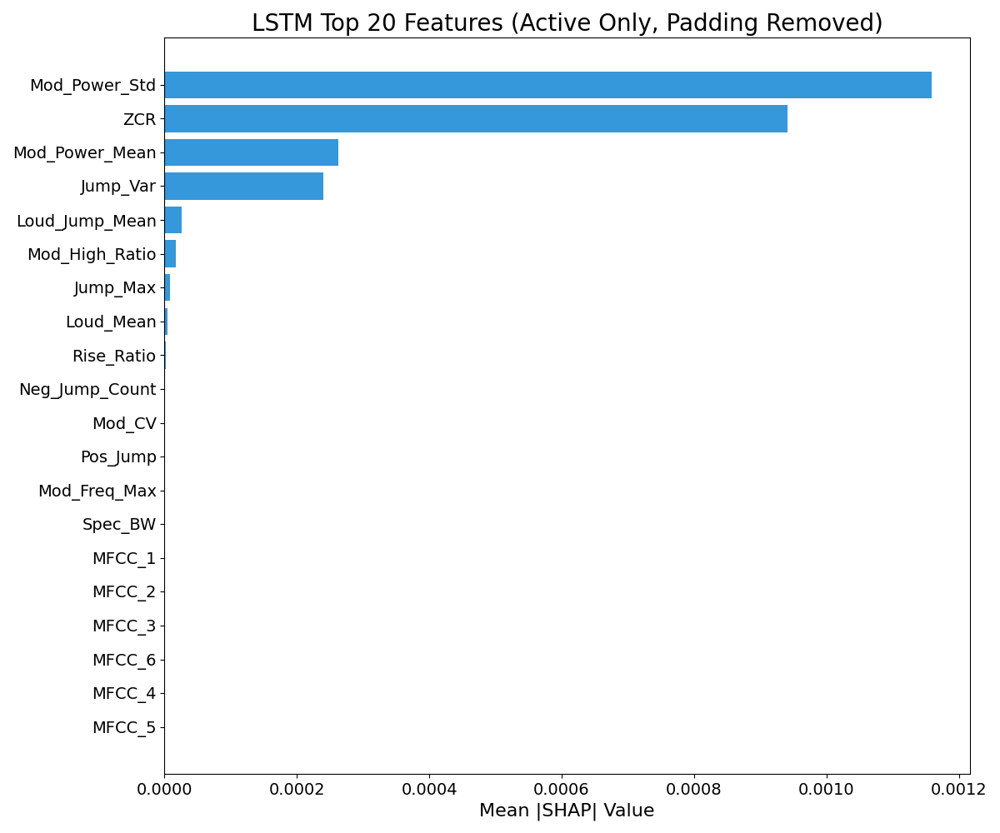
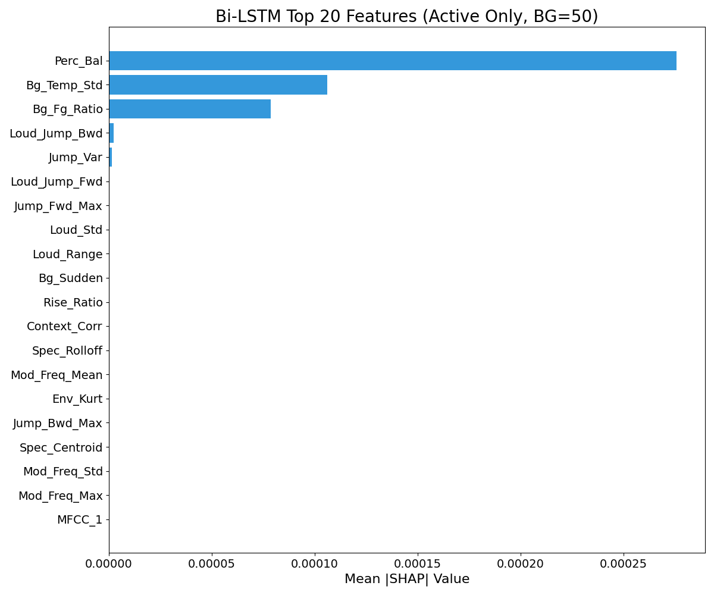
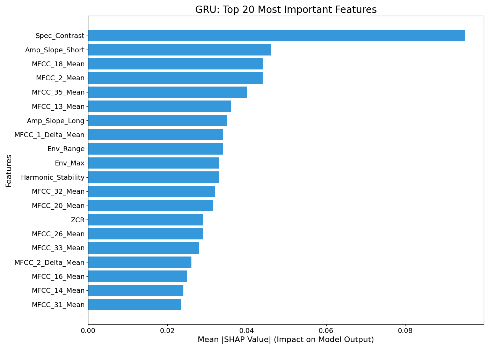
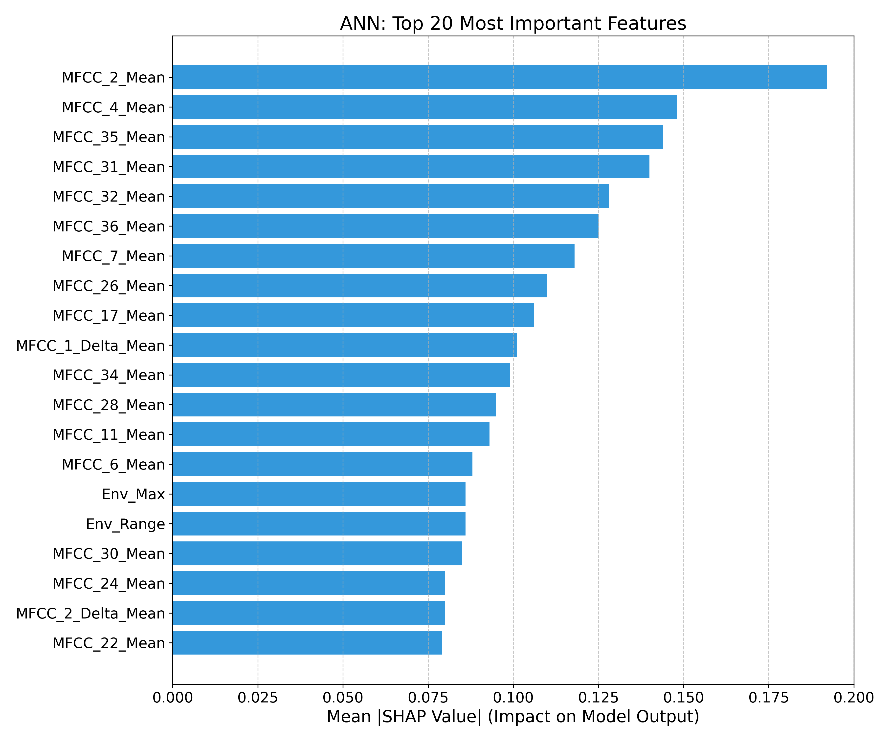

# SHAP Feature Importance Analysis

To assess the impact of the increased feature set, we performed a feature significance analysis using SHAP (SHapley Additive exPlanations). This document visualizes the top 20 most influential features for each classifier to interpret which acoustic cues (temporal, spectral, or modulation) drive detection decisions.

---

## 1. Tree-Based Models

The following plots illustrate the feature importance for Random Forest, Decision Tree, XGBoost, and the Ensemble model.

### Random Forest & Decision Tree

### XGBoost & Ensemble

**Observation:**
Across the panel of the four tree-based models, the majority of the significant descriptors are the amplitude slopes (both short and long window), spectral contrast, and envelope range. This confirms that tree-based classifiers heavily utilize specific temporal envelope trends and abrupt level changes rather than relying solely on static MFCC means.

---

## 2. Deep Learning Models

The following plots illustrate the feature importance for LSTM, Bi-LSTM, GRU, and ANN architectures.

### LSTM & Bi-LSTM

### GRU & ANN

**Observation:**
The recurrent and feed-forward models depict different, but complementary, patterns. The GRU ranks spectral contrast and short-term amplitude slope highly, focusing on sharp spectral-temporal transitions. The LSTM and Bi-LSTM plots emphasize modulation power statistics and loudness jumps—higher-level cues derived in our pipeline.

**Specific Note on ANN:**
The ANN plot is largely influenced by the low-order MFCC means, with the envelope range and maximum making up the minor contributions. Thus, the feed-forward network mainly exploits spectral envelope shapes but still benefits from the added temporal descriptors.

---

## 3. Overall Conclusion

In total, these eight SHAP diagrams show that the models very often give a high significance to those features which have been elaborately derived from the temporal and modulation domains: **amplitude slopes and jumps, loudness dynamics, modulation power statistics, and background-foreground ratios**, together with a small set of MFCCs.

Such an agreement across models of different architectures constitutes solid empirical evidence that the proposed feature design captures characteristic amplitude changes, loudness evolution, and modulation patterns of deepfake audio. It demonstrates that these engineered descriptors serve as the primary detection signals rather than auxiliary metrics.
